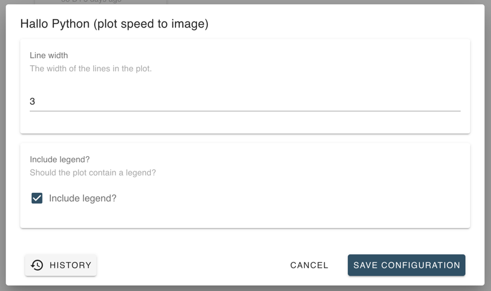
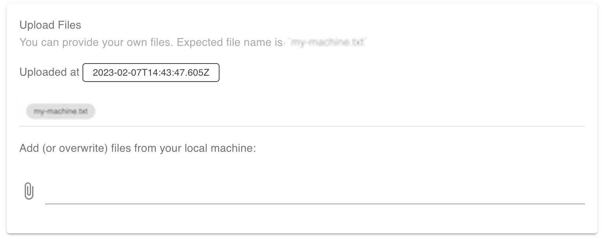

# MoveApps Python Software Development Kit (SDK)

This documentation provides a short introduction to the [MoveApps](https://www.moveapps.org) **Python SDK**.

As a first step, and before your read this, you should have forked this GitHub template to your personal space and named the repository as your App will be named in MoveApps.

# Overview

This template is designed according to a file structure that is necessary for your App to run in your local development environment similar to the way it will run in the MoveApps environment later. Please contain the structure and only change/add files as necessary for your App's functionality. See below which files can be changed and which should remain as is for simulation of the behaviour on MoveApps on your local system. A stepwise explanation below indicates the function and some background of each file and folder.

## File structure

```
.
├── app
│   └── app.py
├── appspec.json
├── environment.yml
├── resources
│   ├── auxiliary
│   ├── output
│   └── samples
│       └── input1.pickle
├── sdk
│   ├── moveapps_execution.py
│   ├── moveapps_io.py
│   └── moveapps_spec.py
├── sdk.py
├── tests
│   ├── app
│   │   └── test_app.py
│   └── resources
│       ├── app
│       │   └── input2.pickle
│       └── output
```

1. `./app/app.py`: This is the entrypoint for your App logic. MoveApps will call this class during a workflow execution which includes your App.
**The class must be named `App` and the file must be named `./app/app.py`, do not alter it!**
1. `./appspec.json`: This file defines the settings and metadata of your App, for details refer to the [MoveApps User Manual](https://docs.moveapps.org/#/appspec)
1. `./environment.yml`: Definition of the dependencies of your App. We use `conda` as library manager.
1. `./resources/**`: Resources of the SDK
   1. `auxiliary/**`: Simulates the usage of [*auxiliary App files*](https://docs.moveapps.org/#/auxiliary). You can put files into this folder to simulate an App run with provided/user-uploaded files. 
   1. `output/**`: If your App produces [*artefacts*](https://docs.moveapps.org/#/copilot-r-sdk?id=artefacts) they will be stored here.
   1. `samples/**`: Collection of sample App input data. You can use these samples to simulate an App run with real input.
1. `./sdk/**`: The (internal) MoveApps Python SDK logic.
   1. `moveapps_execution.py`: The logic for simulating an App run.
   1. `moveapps_io.py`: Helper functions to use IO features of MoveApps.
   1. `moveapps_spec.py`: The python App specification each MoveApps Python App must implement
1. `./sdk.py`: The main entry point of the SDK. Use it to execute your App in your IDE
1. `./tests/**`: Location for **Unit Tests**

## SDK Runtime environment

Critical parts of the SDK can be adjusted by `environment variables`. 
Keep in mind that these variables are only changeable during App development and not during an App run on MoveApps.
They are predefined with sensible defaults - they should work for you as they are.

- `SOURCE_FILE`: path to input file for your App
- `CONFIGURATION_FILE`: configuration of your App (json - must correspondent with the `settings` of your `appspec.json`)
- `PRINT_CONFIGURATION`: prints the configuration your App receives
- `USER_APP_FILE_HOME_DIR`: home aka base directory of your local user App files (*auxiliary*)
- ~~`LOCAL_APP_FILES_DIR`~~: Deprecated! base directory of your local App files (*auxiliary*)
- `OUTPUT_FILE`: path to output file of your App
- `APP_ARTIFACTS_DIR`: base directory for writing App artifacts

You can adjust these environment variables by adjusting the file `./.env`.

## MoveApps App Bundle

Which files will be bundled into the final App running on MoveApps?

- everything in `./app/**`
- your conda environment definition `./environment.yml`
- all directories defined in your `appspec.json` at `providedAppFiles` 

Nothing else.

## App development

1. Create the conda environment by `conda env create -n APP_NAME --file environment.yml`
1. Execute `python sdk.py`
1. Ensure the sdk executes the vanilla template App code. Everything is set up correctly if no error occurs and you see something like _Welcome to the MoveApps Python SDK._
1. Begin with your App development in `./app/app.py`

---

As mentioned, MoveApps will call your custom App business logic in `./app/app.py`. It will instantiate the class `App`. So do not alter the class name or the file name.

The SDK calls so called `hook`s. These hooks must be implemented by the App. Currently, there is only the following [hook specified in `./sdk/moveapps_spec.py`](sdk/moveapps_spec.py):

```
@hook_spec def execute(self, data: TrajectoryCollection, config: dict) -> TrajectoryCollection:
```

A [proper implementation](app/app.py) of this hook specification looks like this:

```
@hook_impl def execute(self, data: TrajectoryCollection, config: dict) -> TrajectoryCollection:
   """Your app code goes here"""
   return data
```

## Synchronization of your fork with this template

This template includes a _GitHub action_ to keep your fork synchronized with the original template (aka the MoveApps R SDK). The synchronization action creates a _GitHub pull request_ in your fork from time to time in case the original template has changed.

## Examples

### Request App configuration from your users

`./appspec.json`: define the settings UI on MoveApps. Users of your App can enter their configuration values.



```
"settings": [
 {
   "id": "line_width",
   "name": "Line width",
   "description": "The width of the lines in the plot.",
   "defaultValue": 2,
   "type": "INTEGER"
 },
 {
   "id": "legend",
   "name": "Include legend?",
   "description": "Should the plot contain a legend?",
   "defaultValue": false,
   "type": "CHECKBOX"
 }
],
```

`./app-configuration.json`: this is only needed during the app development to simulate an App run

```
{
  "line_width": 2,
  "legend": true
}
```

`./app/app.py`: your App will be called with the user's App configuration

```
@dataclass
class AppConfig:
    line_width: int
    with_legend: bool

class App(object):
   @staticmethod
    def map_config(config: dict):
        return AppConfig(
            line_width=config['line_width'] if 'line_width' in config else 5,
            with_legend=config['legend'] if 'legend' in config else False
        )
   
    @hook_impl
    def execute(self, data: TrajectoryCollection, config: dict) -> TrajectoryCollection:
        app_config = self.map_config(config=config)
        # [..]
```

`./tests/app/test_app.py`: do not forget to test your App

```
def test_app_config_mapping_defaults(self):
   # prepare
   config = {}

   # execute
   actual = self.sut.map_config(config=config)

   # verify
   self.assertEqual(5, actual.line_width)
   self.assertFalse(actual.with_legend)
```

### Produce an App artefact

Your App can write files which the user can download after it has run.

`./appspec.json`

```
  "createsArtifacts": true,
```

`./app/app.py`

```
plot = data.plot(
   column="speed",
   linewidth=app_config.line_width,
   capstyle='round',
   legend=app_config.with_legend
)
plot.figure.savefig(self.moveapps_io.create_artifacts_file('plot.png'))
```

### Include files to your App

You can include files to your final App, e.g. a directory containing files of a _Shapefile_.

`./resources/auxiliary/user-files/{file-set-identifier}`

_We use `my-app-files` as `{file-set-identifier}` for this example. Also, we want to provide the simple file `the-file.txt`._

---

`./appspec.json`

```
"providedAppFiles": [
 {
   "settingId": "my-app-files",
   "from": "resources/auxiliary/user-files/my-app-files"
 }
],
```

Next, store your necessary file(s) in the defined folder. For our example add the file `./resources/auxiliary/user-files/my-app-files/the-file.txt`

Somewhere in you App code (like `./app/app.py`) you can access this file with the help of the SDK utility method `moveapps_io.get_app_file_path()` like:

```
def _consume_app_file(self):
    app_file_base_dir = self.moveapps_io.get_app_file_path('my-app-files')
    if app_file_base_dir:
        expected_file = os.path.join(app_file_root_dir, 'the-file.txt')
        # do something with this file
```

### Let the user upload files to your App

Sometimes it is useful that a MoveApps user working with your App can upload his/her own files during runtime. The SDK provides a way to access these uploaded files.

With this mechanism it is also possible to let the user _overwrite_ your provided app files. Therefor we will extend the previous example in the following.

`./appspec.json`

```
"providedAppFiles": [
 {
   "settingId": "my-app-files",
   "from": "resources/auxiliary/user-files/my-app-files"
 }
],
"settings": [
 {
   "id": "my-app-files",
   "name": "Upload your own file",
   "description": "You can provide your own file. Expected file name is `the-file.txt`",
   "defaultValue": null,
   "type": "LOCAL_FILE"
 }
]
```



By using the same helper method for loading the app-file we can use the uploaded file:

```
def _consume_app_file(self):
    app_file_base_dir = self.moveapps_io.get_app_file_path('my-app-files')
    if app_file_base_dir:
        expected_file = os.path.join(app_file_root_dir, 'the-file.txt')
        # do something with this file
```

The rules are:

1. If the user uploaded the expected file, then the App uses it
1. If the user did not upload the expected file and you as the App developer provided the file, then the App uses the provided file

_In short: files from the users win over files provided by the app developer_

Note that, if neither the user uploaded the expected file, nor you as the App developer provided the file, the App might run into an error - depending on the code desing handling the return value of `moveapps_io.get_app_file_path()` in `./app/app.py`.
